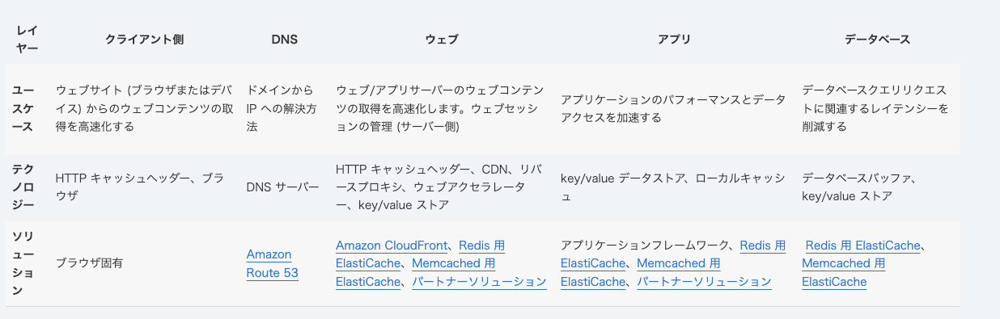

# キャッシュを学び直す

## キャッシュとは
データの一部を一時的に保存しておき、再度同じデータにアクセスする時に、実際に保存されている場所に問い合わせするよりも早くデータを取得できるようにしておくこと
データの一部を保存しておき、使いまわせるようにしておけば、どんなレイヤーで使われてもそれば「キャッシュ」と呼ばれる

## キャッシュに適するデータの性質
- 削除が許容されること
- 読み込み頻度が高いこと
- 書き込み頻度が低いこと

### キャッシュのメリット
低速なストレージにアクセスする必要を減らすことによって、データ取得のパフォーマンスを向上させること

- アプリケーションのパフォーマンス向上
- データベースのコスト削減
  - スループットごとに課金されるような場合、キャッシュから読み取ることにすることで費用を削減できる
- 予測可能なパフォーマンス
  - 外部サービスからデータを取得する場合、負荷状況など色々な要因でパフォーマンスが予測できない
  - インメモリキャッシュを利用することでパフォーマンスが予測可能になる
- データベースのホットスポットを排除する
  - 多くのデータの中でも、アクセスされる頻度は変わる。有名人のデータや、人気の商品などは頻繁にアクセスされるため、データベースにホットスポットが発生する可能性がある
  - ホットスポットが発生することで、データベースリソースを超過し、オーバープロビジョニング領域まで使用する場合も起こり得る
  - インメモリキャッシュにアクセス頻度が高いデータを保存しておくことで、ホットスポットが発生する可能性を提言できる
- 読み取りスループット（IOPS）の増加
  - 外部サービスにアクセスせず、インメモリで済ませられるため、レイテンシーが短くなる

### キャッシュのデメリット
- 適切な管理をする必要がある
  - キャッシュはあくまで一時的な保存を行うことなので、消えることが前提である。

### 適用先
読み込みが発生するような箇所のレイヤーに適用できる
- オペレーティングシステム
- コンテンツ配信ネットワーク（CDN）
- DNS
- webアプリケーション
- データベース

### キャッシュをするデータ
- データベースクエリの結果
- 計算量の多い計算
- APIリクエスト/応答
- HTML
- JavaScript
- 画像ファイル
そのほかにも色々

## どんな種類のキャッシュがあるか

[【引用】キャッシュの概要](https://aws.amazon.com/jp/caching/)

### キャッシュ１：オープンソースインメモリデータストア
#### Redis(REmote DIctionary Server)
- client/server モデルを採用している
    - アプリケーション側でRedis Client Library を利用し、TCP/IP を通してRedisServer にリクエストする
    -
- シングルスレッド動作
  - Server/Client モデルを採用していることから、リクエストの捌き方を決める必要がある
  - リクエストの捌きかたがシングルスレッド
  - マルチスレッドよりも完結なため、こちらを採用している
#### Memcached(memory cache daemon)
- マルチスレッド動作
- 
### キャッシュ２：local caches
アプリケーションサーバーのメモリにデータをキャッシュすること
ネットワークを介さないので安定する
しかし、アプリケーションサーバーを複数インスタンスで運用する場合、サーバ間でデータの不整合が起きる可能性があるため注意が必要
### キャッシュ３：remote caches
DBとアプリケーションサーバーの間にキャッシュサーバを置き、アプリケーションはキャッシュサーバからキャッシュ情報を取得する
インターネットを介すが、データの不整合が起きない

### キャッシュ４

## キャッシュ戦略
一時的にデータを保存するという特性上、データが更新され得る場合、最新のデータを返す保証がないことを考慮する必要がある

#### C10K 問題
クライアントが約1万台に達すると、Webサーバーの性能に余裕があるにも関わらず、レスポンス性能が大きく下がる問題
クライアント1つ1つにプロセスを生成する仕様の場合、OSの最大プロセス数を使い果たすという問題
Nginx Redis,Memcached ではC10K 問題が怒らないようにイベントループを回している

#### イベントループ

## キャッシュのベストプラクティス

重要なこと
データの有効性を把握することが重要。TTL（有効期限）などのコントロールを適用して、必要に応じてデータの有効期限が切れるように設定できる
キャッシュ環境に高可用性が必要であれば、Redis
などのインメモリエンジンを使用できる。
インメモリレイヤーを独立したデータストレージとして使用できる
インメモリエンジンないに存在するデータに対して、適切なRTO/RPOを定義することが重要
様々なインメモリエンジンの設計戦略と機能を適用して、要件を満たすことができる

### アーキテクチャパターン
- Cache-Aside Pattern
シンプルなアーキテクチャ
キャッシュサーバーを用意して、アプリケーションサーバーに適宜問い合わせをする
集中型のキャッシュサーバーを用意するにあたってキャッシュを保持するタイミングが異なる2つのパターンがある
  - read-aside-pattern
  データを読み込んだ時にキャッシュとして保存する
  - write-aside-pattern
  書き込みを行った時にキャッシュを行う

- Broker Pattern
キャッシュにあったらキャッシュから返す
なかったら1時ストレージに問い合わせ、その結果を返しつつキャッシュに入れる
メリット
- アクセス頻度が高いデータがキャッシュに保存される
デメリット
- 最初の取得が思い
- キャッシュが蓄えられていない場合に、全て１次ストレージに向く
- 

## キャッシュのユースケース
### データベースキャッシュ
### CDN（コンテンツ配信ネットワーク）
### ドメインネームシステム（DNS）キャッシュ
### セッション管理

### アプリケーションプログラミングインターフェース（API）
### webキャッシュ
### 一般的なキャッシュ
### 統合キャッシュ

## キャッシュサーバー
「データをあらかじめ保存しておく」役割をになっていればそれはキャッシュとして呼ばれることになる
キャッシュの役割を持ったサーバーが独立して存在しても良い

### リバースプロキシ型キャッシュサーバー
### 分散キャッシュサーバー
### データベースキャッシュサーバー

## ElastiCache
### 概要
サーバーレスで、RedisとMemcached と互換性のあるキャッシングサービス
### シャードとノード

#### シャード
シャーディングされたデータベース
シャーディングとは、1つの大規模なデータベースをデータシャードと呼ばれる小さい大きさに分割すること
パフォーマンス、スケーラビリティが、コスト効率が向上する

### 外部サービスのインメモリキャッシュ？
インメモリキャッシュとは、その名前の通りメモリに保存されたキャッシュのことを指す
外部サービスとは、対象のアプリケーション内部では完結しない、別のサービスである
つまり、インメモリは内部。外部サービスは外部。という棲み分けになる
一見矛盾しているが、分散システムの文脈では内部、外部の境界が少し異なる

結論から言うと、同一のVPCの中で運用されている場合、それば内部サービスと判断される

# 疑問
- 分散した場合、何をキャッシュしたかをそれぞれのAPIサーバインスタンスは観測できないのに、どうやって同期するのか
  - ローカルキャッシュの場合は同じ懸念が発生する。リモートキャッシュの場合は発生しない

# 関連ワード
- 分散システム
- データベース

# 参考文献
https://qiita.com/Shiruba/items/7810a686d8510fd1555a
[【図解】キャッシュ戦略って何？キャッシュを使ったクエリチューニングって何？](https://qiita.com/WebEngrChild/items/b9b21c1d2d133d523389)
[Webアプリケーションにおける正しいキャッシュ戦略](https://buildersbox.corp-sansan.com/entry/2019/03/25/150000)
