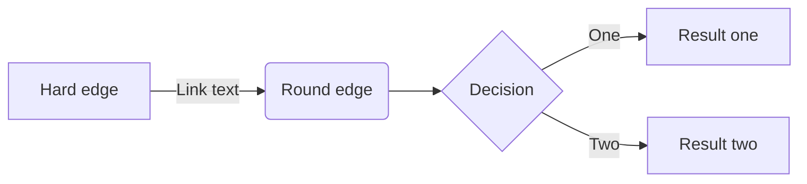

# O記法とは
ランダウのO記法

## O記法の定義
## O記法を理解するための語句
- 計算回数
- オーダー
- N
## O記法の考え方

## O記法が必要な理由

## オーダーについて
### N の場合
計算回数がN回
### N^2 の場合

### N

## 図

```mermaid
graph LR
    A[Hard edge] -->|Link text| B(Round edge)
    B --> C{Decision}
    C -->|One| D[Result one]
    C -->|Two| E[Result two]
```