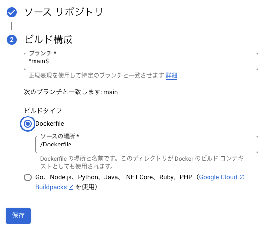

# サービスベースアーキテクチャとは
マイクロサービスまでは行かないが、機能ごとのサービスを立てて、DBを共有するアーキテクチャの事
マイクロサービスほど境界を分割しないため、既存のDBからの分割が難しい場合などに収束する

# 実際に実装してみる

## サービスベースアーキテクチャで実装するサービスを決める
今回は簡単に、お金の管理アプリにしましょう

## サービスベースアーキテクチャのサービスにどんなサービスが必要か決める
下記の2つのサービスがあると仮定してお話を進めます。
- ユーザー系のサービス
- お金の管理サービス


## 使用する技術とか諸々

クラウドサービス
- google cloud
  - CloudRun
  - Firestore

API フレームワーク
- NestJS

言語
- TypeScript

リポジトリ構成
- モノレポ
  - ルートディレクトリから2つのサービス用のディレクトリを生やす

# 環境構築

リポジトリ内での依存管理
NestJSがDI をいい感じにしてくれるのでなるべくDI して依存関係逆転を行いつつ疎結合にしていく

注意。NestJS をモノレポで実装する場合、1つのルートディレクトリ配下に複数のサービスを作る時は`nest new {project-name} --skip-git` と入力すること

# Firestore とFirebase とgcp
## Firestore とは
Firestore はgoogle cloud とFirebase の両方から接続できるNoSQLデータベース。
Key-Value のペアが保存される「ドキュメント」があり、それが「コレクション」と言う大きなくくりでまとめられます。
RDBで言うテーブルが「コレクション」で、「ドキュメント」がKey。Key に紐づくValue を保存していくようなイメージでしょうか。

ただし、Value は1つだけではなく複数のフィールドも持つことができます。
例えば、Userの1つを示すドキュメントがあり、そのKey が`userId`だとした場合、`name, email` の2つを持つことができます。
この場合はValueは「2つのフィールドを持つ1つのValue」として作成されます。
```
Key: userId, 
Value: 
  - name: "testName"
  - email: "test.com"
```

コレクションはドキュメントをまとめたもの。と言うことになるので、`users` と言うコレクションに対してuserId をKeyに持つドキュメントが1:1...N で紐づくことになります。
Firestoreはスキーマレスであることもあり、RDBのようにDDLなどでこのテーブルはA,B,C が含まれている！と言うのを決めて上げることはしません。
ドキュメントごとに異なるフィールドを持たせることもできます。

詳しくは[Firestore の概要](https://cloud.google.com/Firestore/docs/overview?hl=ja)を参考にしてください

## SDK について
Firestore は上記で少し触れたように、Firebase 用のSDKとgoogle cloud 用のSDKが存在します。
今回のようにAPIサーバから接続したいなら、google cloud用のSDKを使用してください。
接続方法が全く異なりますが、Node.js からの接続を行う場合、Firebase 用とgoogle cloud 用のどちらもインストールできてしまうので注意してください。

Firebase 用は[@firebase/firestore](https://www.npmjs.com/package/@firebase/firestore)

google-cloud 要は[@google-cloud/firestore](https://www.npmjs.com/package/@google-cloud/firestore) 

となっています。

## docker-compose による環境構築
ローカル環境では、直接クラウド環境のFirestore に繋ぐ必要はないため、エミュレーターを使用します。
今回は2つのサービスと、Firestore エミュレーターの合計3つのコンテナを起動させます。

```yaml
version: '3'
services:
  auth-service:
    build:
      context: .
      dockerfile: Dockerfile
    ports:
      - "3000:3000"
    volumes:
      - ./auth-service:/usr/src/app
    command: npm start
    environment:
      - NODE_ENV=development
    depends_on:
      - firestore-emulator

    networks:
      - emulator-network

  money-service:
    build:
      context: .
      dockerfile: Dockerfile.money
    ports:
      - "3002:3002"
    volumes:
      - ./money-service:/usr/src/app
    command: npm start
    environment:
      - NODE_ENV=development
    depends_on:
      - firestore-emulator

    networks:
      - emulator-network

  firestore-emulator:
    image: gcr.io/google.com/cloudsdktool/cloud-sdk:316.0.0-emulators
    command: gcloud beta emulators firestore start --host-port=0.0.0.0:8080
    ports:
      - "8080:8080"
    networks:
      - emulator-network

networks:
  emulator-network:
    driver: bridge

```


# 実装

## ユーザー系サービスの実装
## 依存関係
まず、NestJSのアプリケーションを作成した時点で、"Hello world"を返却するAPIは実装されており、Get リクエストを受け取る基盤はすでに提供されています。
`app.module`, `app.controller`, `app.service` が作成時に提供されています。

今回はデータストアであるFirestore に接続する必要があるため、`Repository` 定義し、app.Service が app.Repository に依存するようにします。

`src/repository` を作成し、`user-repository.ts` を作成します。
今回は簡単のために、ユーザーを作成するだけのメソッドを作成しましょう。
Firestore にユーザー作成を行う命令を出す必要がありますが、まだFirestoreの初期化処理を作成していないので、実装は空の状態です。

```TypeScript user-repository.ts
import { Inject, Injectable } from '@nestjs/common';

import { ulid } from 'ulid';
import { User } from '../model/user';
import { Firestore } from '@google-cloud/firestore';


@Injectable()
export class UserRepository {
  // TODO Firestore の依存を定義する
  constructor() {}

  async createUser(name: string, email: string) {
    // TODO Userを作成するロジックを実装する
  }
}

```

---

`app.service.ts` がRepository に依存するように書き換えましょう
```TypeScript
import {Injectable} from "@nestjs/common";
import {UserRepository} from "./repository/user-repository";
import { CreateUserDto } from './dto/create-user.dto';

@Injectable()
export class AppService {
  constructor(private userRepository: UserRepository) {
  }

  async createUser(user: CreateUserDto) {
    await this.userRepository.createUser(user.name, user.email)
  }
}


```

## Firestore に接続する
まずはFirestoreに接続する準備を行います。
今回はFirebase を使用しないため、google-cloud のSDKをインストールします。
```shell
npm install @google-cloud/Firestore
```

次にFirestoreに接続するための接続情報を渡してインスタンスを生成します。
```TypeScript app.module
import { Module } from '@nestjs/common';
import { UserService } from './user.service';

import { UserRepository } from './repository/user-repository';
import { UserController } from './user.controller';
import { Firestore } from '@google-cloud/firestore';
import { ConfigModule, ConfigService } from '@nestjs/config';

@Module({
  imports: [ConfigModule.forRoot({ envFilePath: ['.env', '.env.local'] })],
  controllers: [UserController],
  providers: [UserService, UserRepository,
    {
      provide: 'FIRESTORE_INSTANCE',
      useFactory: async (configService: ConfigService) => {
        const firestore = new Firestore({
          projectId: 'your-project-id',
          port: 8080,
          ssl: false,
          host: 'firestore-emulator',
        });
        console.log(firestore.databaseId)
        console.log(firestore.listCollections())

        return firestore;
      },
      inject: [ConfigService],
    },
  ],

})
export class AppModule {
}

```

## Firestore にデータを保存する
userRepository を作成して、ユーザーを生成するメソッドを作成。
この時点でFirestoreに接続する準備をAppModule が行ってくれるようになったので、Repository側でFirestore を呼び出すように修正しましょう。

```TypeScript user-repository.ts
import { Inject, Injectable } from '@nestjs/common';

import { ulid } from 'ulid';
import { User } from '../model/user';
import { Firestore } from '@google-cloud/firestore';


@Injectable()
export class UserRepository {
  private db: Firestore

  // AppModule ではFIRESTORE_INSTANCEとして登録しているので、この名前で呼び出します
  constructor(@Inject('FIRESTORE_INSTANCE') db: Firestore) {
    this.db = db;
  }

  async createUser(name: string, email: string) {
    const id = ulid()
    const user:User = {id , email, name}
    const writeResult = await this.db.collection('users').doc(user.id).set(user);
    console.log(`User with ID: ${id} added at: ${writeResult.writeTime.toDate()}`);
  }
}

```

## 環境変数を使ってエミュレーターへの接続も行えるようにする
理論上、Firestore に接続できるように作成しましたが、ローカルで動作することを確認したいため、エミュレーターのFirestore でも動作するようにします。
環境変数を使ってエミュレーター用の接続をするかどうかを切り替えられるようにします。

app.module を修正して、ConfigService から環境変数の値を読み込み、if文で分岐させます。
環境変数はdocker-compose で設定しても良いですし、Dockerfile で設定しても良いです。

```TypeScript user-repository.ts
import { Module } from '@nestjs/common';
import { UserService } from './user.service';

import { UserRepository } from './repository/user-repository';
import { UserController } from './user.controller';
import { Firestore } from '@google-cloud/firestore';
import { ConfigModule, ConfigService } from '@nestjs/config';

@Module({
  imports: [ConfigModule.forRoot({ envFilePath: ['.env', '.env.local'] })],
  controllers: [UserController],
  providers: [UserService, UserRepository,
    {
      provide: 'FIRESTORE_INSTANCE',
      useFactory: async (configService: ConfigService) => {
        const useEmulator = configService.get('USE_FIRESTORE_EMULATOR') === 'true';
        let firestore: Firestore;
        console.log(useEmulator)

        if (useEmulator) {
          firestore = new Firestore({
            projectId: 'your-project-id',
            host: 'firestore-emulator',
            port: 8080,
            ssl: false,
          });
          console.log(firestore.databaseId)
          console.log(firestore.listCollections())
        } else {
          console.log('Using Firestore production instance');
          const projectId = configService.get('PROJECT_ID');
          firestore = new Firestore({
            projectId,
          });
        }

        return firestore;
      },
      inject: [ConfigService],
    },
  ],

})
export class AppModule {
}

```

# 本番環境にデプロイする
本番環境でFirestoreに通信し、データが保存されることを確認しましょう。
基本的な流れとしては下記のようになっており、基本的には下記のような手順になっています。
[公式のドキュメント](https://cloud.google.com/run/docs/quickstarts/deploy-continuously?hl=ja) で予習をしておくとお話が早いです。
1. google cloud のアカウントを作成する
2. サービスを作成する
   - リポジトリにCloud Run を紐づける
   - ビルドするDockerfileを指定し、ビルドを行う

## 1. google cloud のアカウントを作成する
[公式のドキュメント](https://cloud.google.com/apigee/docs/hybrid/v1.8/precog-gcpaccount?hl=ja)を参考に、プロジェクトを作成してください

## 2. サービスを作成する
[Cloud Run](https://console.cloud.google.com/run)のページに移動し、サービスを作成します。

サービスを作成ボタンを押下し、サービス作成画面へ行きます


リポジトリから継続的にデプロイする。を選択し、`CLOUD BUILDを設定` ボタンを押下します。
Cloud Build の設定という画面がでてきます。
初めて開く場合はGithub アカウントとの接続ができていないので、アカウントの接続から始めてください。
`接続されたリポジトリを管理します` のリンクからお持ちのGithubアカウントと連携してください。

連携ができれば、画像のようにリポジトリを選択できるようになります。
リポジトリを選択したら、`次へ`ボタンを押下し、ビルドタイプを選択します。


ビルドタイプは `Dockerfile`を選択してください。


ビルドする時のDockerfile の場所を入力します。起点になるディレクトリは、選択したリポジトリのルートディレクトリになります。
ルートディレクトリにDockerfile を置いている場合は初期設定で大丈夫です。
場所を設定したら保存してください。



サービス名、リージョンを設定します。
リポジトリの名称そのままでも良いですが、今回は1つのリポジトリに2つのサービスが実装されるので、末尾に **-auth** などのプレフィックスをつけると良いです。
リージョンはどこでも良いですが、良いリージョンを選択すると余分にお金がかかるため、今回は`us-central1`を設定します。

「認証」の設定はあとで変えられますが、不要にアクセスされないように「認証が必要」にチェックしておきましょう。

コンテナ、vol.、ネットワーキング、セキュリティの欄を開き、コンテナのポートを3000 に変更します。


残りはデフォルト設定のままにして作成ボタンを押下してください。
設定したDockerfileを対象にして、ビルドが始まります。

またこの時、ビルドした時のログはログエクスプローラーに出力されています。
resource type > cloud build にフィルターを設定すると、何が原因でダメかが書いてあります。
Cloud Build の画面でもログがでますが、iam に権限がない場合など、そもそもビルド自体ができなかったりする場合はCloud Build のログはでてこないため、ログエクスプローラーを参考にすると良いかもしれません。

Cloud Run にデプロイし、正しくビルドできればコンテナにアクセスできる状態にはなっているはずです。


## Firestore を作成する
アプリがデプロイできたとしても、接続対象のFirestoreデータベースがなければ動作しません。
[Firestoreのコンソール](https://console.cloud.google.com/firestore/databases)からデータベースを作成しましょう。

データベースIDに`(default)` を指定すると無料枠モードで使用することができます。
CloudRunのリージョンと同じリージョンを指定してデータベースを作成しましょう。

## 本番環境のAPIを実行する
Cloud Run のサービスを作成する時に設定時に公開するか、認証が必要かを選択したと思います。
これを一時的に「公開する」に設定し、直接APIを実行します。

# 相互に通信するようにする

money-service からuser-service のAPIを実行する
```shell
npm i --save @nestjs/axios axios
```
