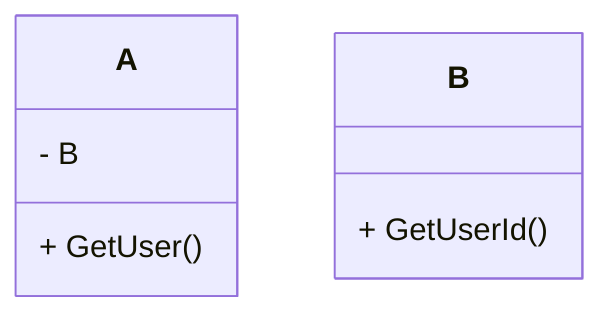
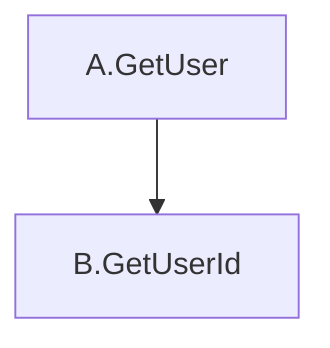

# 埋め込みと仲良くなりたい

## Go の埋め込みはなんのためにあるか

Effective Go には下記のように記述されている
> Go does not provide the typical, type-driven notion of subclassing, but it does have the ability to “borrow” pieces of an implementation by embedding types within a struct or interface.
> Goには、典型的な型駆動型のサブクラス化の概念はないが、構造体やインターフェイスの中に型を埋め込むことで、実装の一部を「借りる」機能はある。

"借りる" 機能であると明言されているように、埋め込みはあくまで埋め込まれている構造体の機能を借りてくるために存在している。
そのため、他の言語に存在している継承とは異なり、関数を上書きする事はできない。


## 埋め込むと何ができるようになるか

埋め込みが行えるのは`interface` と`struct` の２種類。
`interface` には`interface` だけを埋め込める。
`struct` には`struct` と`interface` を埋め込める。


### 構造体に対する埋め込み
A の構造体にBの構造体を埋め込むと、AのインスタンスからBの持つ関数を呼び出す事ができる
同様に、`interface` を埋め込むと、AのインスタンスからIの持つ関数を呼び出す事ができる

もちろん、構造体の実体を作る必要があり、インターフェースを埋め込んでいる場合はインターフェースを満たした構造体を初期化時に渡す必要がある。
[playGround](https://go.dev/play/p/0XqoX5hsvMu)

```Go
package main

import "fmt"

func main() {

	a := &A{B: B{id: 1}, I: C{name: "Struct C"}}

	fmt.Println(a.GetId())
	fmt.Println(a.B.GetId())

	fmt.Println(a.GetName())
	fmt.Println(a.I.GetName())
}

type A struct {
	B
	I
}

type I interface {
	GetName() string
}

type B struct {
	id int
}

func (b B) GetId() int {
	return b.id
}

type C struct {
	name string
}

func (c C) GetName() string {
	return c.name
}


```

### interface に対する埋め込み

インターフェースAにインターフェースBを埋め込む場合、A,Bの両方を満たす構造体が必要です。


```Go
package main

func main() {

	a := service{&Putter{}}

	a.SetId(1)
	a.SetName("name")
}

type service struct {
	Ie
}

type Ie interface {
	embed
	SetId(id int)
}

type embed interface {
	SetName(name string)
}

type Putter struct {
	id   int
	name string
}

func (p *Putter) SetId(id int) {
	p.id = id
}

func (p *Putter) SetName(name string) {
	p.name = name
}

```

## 埋め込んだ構造体のテスト

インターフェースの埋め込みを行う場合、インターフェースの関数全てを満たす構造体があれば良いです。
そのため、テストを作成したい場合、mock用の構造体を作成すれば関数の振る舞いを後から決める事ができます。


一方で構造体の埋め込みの場合はmock する事ができないため、テストは複雑になります。
関数同士で呼び出し合うこともできることを考えると、テストはとても難しくなりそうに感じます。

構造体Aに構造体B が埋め込まれている場合、構造体AはBの関数を呼び出せるため、下記のような依存関係がある場合には`A.GetUser` をテストしたいと思ったら、`B.GetUserId` は実装そのままを使用しなければいけません。





# 終わりに

構造体の埋め込みは、共通処理をまとめる用途などで使用できる場合もありますが、変化が激しいロジックや、他の関数から呼ばれる事が想定される場合はinterface の埋め込みに留めておく方が良さそうだと思いました。


